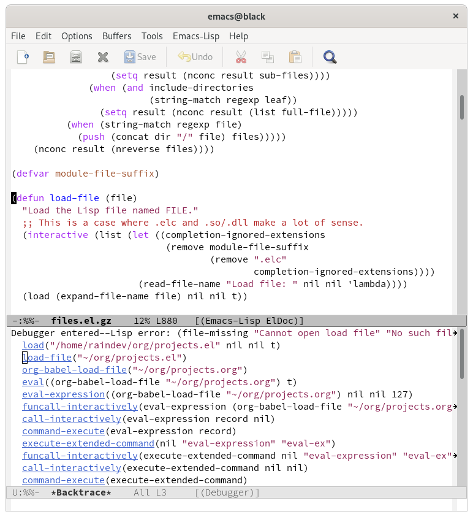
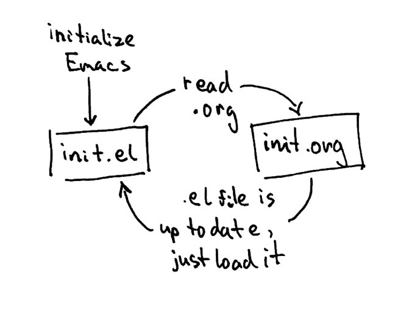

+++
title = "How to not Write Emacs Config in Org"
date = 2021-01-30
+++

I have started simple. `~/.emacs.d/init.el` had just one line:

    (org-babel-load-file "~/.emacs.d/init.org")

`init.org` was simple too:

    #+begin_src emacs-lisp
      (setq org-directory "~/org")
    #+end_src

After restarting Emacs everything seems to have worked fine `C-h v`
told me that the value of `org-directory` is indeed `~/org`.  So far
so good.  I have opened `init.el` and its content was:

    (setq org-directory "~/org")

That's right, the same as the code I had in the source block in
`init.org`.  Clumsy Emacs beginner, I thought, I must have written the
wrong file!  I have fixed it quickly to put `org-babel-load-file` in
the right place and restarted Emacs.  Right after start `*Warnings*`
buffer popped up and showed me this error:

    error: Recursive load, /home/raindev/.emacs.d/init.el, /home/raindev/.emacs.d/init.el, /home/raindev/.emacs.d/init.el, /home/raindev/.emacs.d/init.el, /home/raindev/.emacs.d/init.el

Whoa!  My first line of configuration and somehow I broke Emacs
already and made it load the config again and again.  I searched the
Internet for the error message in vain, in frustration went to #emacs
and cried for help.  I've been told that it looks like
`org-babel-load-file` needs something that hasn't been initialized yet
causing Emacs to attempt to load the config again.  It makes sense, I
thought.  With some guidance (thanks pjb!) I made Emacs load the .org
file 5 seconds later when init.el has already been processed:

    (defun load-org-config ()
      (org-babel-load-file "~/.emacs.d/init.org"))
    
    (run-at-time 5 1 'load-org-config)

Once again, I restarted Emacs.  This time, no error messages on
startup. When I switched to `*Messages*` however, I saw an endless
stream of:

    Loading /home/raindev/.emacs.d/init.el (source)...done
    Loaded ~/.emacs.d/init.el
    Loading /home/raindev/.emacs.d/init.el (source)...done
    Loaded ~/.emacs.d/init.el
    Loading /home/raindev/.emacs.d/init.el (source)...done
    Loaded ~/.emacs.d/init.el
    ...

Hm, this is interesting, I thought.  The problem happened *after*
Emacs was fully initialized as well.  I killed unresponsive Emacs and
started it without loading the config using `emacs -q`. I hit `M-x`
and used `eval-expression` to run `(org-babel-load-file
"~/.emacs.d/init.org")`.  Not surprisingly, the same thing happened:
Emacs started reloading the config endlessly.

In despair, the next time I loaded just a random `projects.org` file
that didn't have any configuration or any source code whatsoever.  I've
got an error.  But also something magical happened - a debugger popped
up!

I could see the chain of function calls that led to the error.  Even
more I could click on them and see the source code.  Wow! This is
amazing!  I had the source code of Emacs' packages right in front of
me.

I started exploring.  The error message was:

    (file-missing "Cannot open load file" "No such file or directory" "/home/raindev/org/projects.el")

That's strange, I thought.  I have loaded `projects.org` and not
`projects.el`.  Something is going on.  Looking at the backtrace I
could see `org-babel-load-file("~/org/projects.org")` - that's the
function I have called.  The next call was
`load-file("~/org/projects.el")` - .org has changed to .el.  Something
must have happened during the previous step.  I clicked on
`org-babel-load-file` and started reading the code:

    This function exports the source code using `org-babel-tangle'
    and then loads the resulting file using `load-file'

And that's what happened a couple of lines below:

    (let* ((tangled-file (concat (file-name-sans-extension file) ".el")

So, the function exports the source code to a file with the same name
but .el extension.  Ah!  As there was no code in `projects.org`
nothing was exported leading to `file-missing` error.

Going back to the original problem with the new knowledge: why wasn't
`init.el` replaced by the code from `init.org` then?  Oh, wait, wasn't
it?  Remember the first time I loaded the Org config, I discovered
I've accidentally written the config to `init.el` directly.  I didn't!

    ;; Tangle only if the Org file is newer than the Elisp file

`org-babel-load-file` did.  As the comment says, the function only
writes .el file if the .org file is newer.  That's what happened the
first time.  Afterwards I kept tweaking `init.el` so it was always
newer than `init.org`.  But what else, when `org-babel-load-file` was
executed Emacs thought `init.el` is the file that has the code
exported from `init.org` and loaded it.  In turn it has called the
same function and entered the endless cycle.

The solution was simple - give the Org config a different name:

    (org-babel-load-file "~/.emacs.d/config.org")

And that's it.  `config.org` will get exported to `config.el` and
loaded once.

