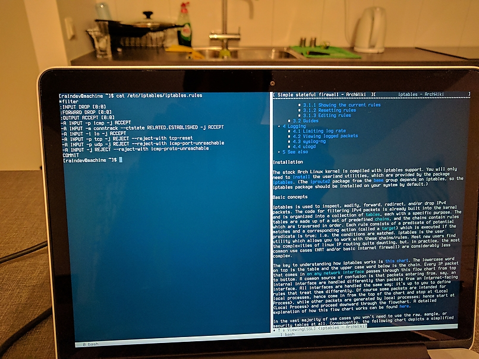

+++
title = "Build Yourself Arch Linux, Part 2"
date = 2017-04-02
aliases = [ "build-yourself-arch-linux-2.html" ]
+++

# Part 2: Getting Work Done from Console

This is the second part of the series of articles ([part 1](@/blog/build-yourself-arch-linux-1.md), [part 3](@/blog/build-yourself-arch-linux-3.md)) about setting up Arch Linux on my MacBook. The main goal of this part is to make the installation actually useful to do some work. In some sense, I want to bootstrap the series to be able to work on the posts under Linux. Disclaimer: I won't get to setting up graphical environment in this part; while it's possible to do everything from this article _after_ installing a graphical environment, I've decided to try how far can I get without one.

## Unprivileged user

It is [not a good idea](https://apple.stackexchange.com/questions/192365/is-it-ok-to-use-the-root-user-as-a-normal-user/192422#192422) to use a computer as root user all the time. [Here](https://wiki.archlinux.org/index.php/Users_and_groups#User_management) is how to create a new unprivileged user and set its password. Beware that a user's home directory is created from a template called skeleton and the default skeleton (`/etc/skel`) contains only a few basic dotfiles templates like `.bashrc`. It may be confusing if you used to see bunch of predefined media directories in your home catalogue.

### sudo

[sudo](https://wiki.archlinux.org/index.php/Sudo) is another recommended security measure. It is not pre-installed, you'll need to get it with `pacman`. I used group `wheel` to give access to `sudo`. The newly created user needs to be added the group. [`visudo`](https://wiki.archlinux.org/index.php/Sudo#Using_visudo) is the way to control access to `sudo` command. Besides giving `wheel` members privileged access I also allowed reboot/shutdown to be performed without need for the password. To do that while editing `/etc/sudoers` I have uncommented the line with `Cmd_Alias` for `REBOOT` and added the following line:`raindev ALL= NOPASSWD: REBOOT`. Now I can run `sudo poweroff` to shutdown my laptop and won't be asked for the password. The same way user can be given a permission to execute other commands requiring privilege escalation without a password.

### polkit

Another option to access power management without need for a password is [`polkit`](https://wiki.archlinux.org/index.php/Polkit) which is a framework for granular access management. Given `polkit` is installed and running (I had to reboot before `systemctl start polkit` succeeded), you'll be able to use `systemctl reboot/poweroff/suspend` without password given that there're no other users logged in.

### Automatic login

Considering that disk encryption password is required to boot there's no point in having to enter user's password every time to log in. The program that manages virtual terminals and their access is called getty. Read [ArchWiki](https://wiki.archlinux.org/index.php/Agetty#Automatic_login_to_virtual_console) for how to configure automatic login for getty.

## Unplugging the laptop

### Wi-Fi

To get Wi-Fi working a driver is needed. The problem is my Wi-Fi card (Broadcom BCM4360) is not supported by the kernel itself and there's no driver available from official Arch Linux repositories. Good news are that almost any package you may need is available from [Arch User Repository](https://wiki.archlinux.org/index.php/Aur) if not found in the official repositories. [`broadcom-wl-dkms`](https://wiki.archlinux.org/index.php/Broadcom#broadcom-wl) is the package we need (update: has been moved into the official community repository). It's a good idea to install [DKMS](https://wiki.archlinux.org/index.php/DKMS) version of the driver to not have to recompile it manually after each kernel upgrade. You'll need to get `dkms` package before installing the driver. There're two ways of installing AUR packages: [manual](https://wiki.archlinux.org/index.php/Aur#Installing_packages) or using [AUR helpers](https://wiki.archlinux.org/index.php/AUR_helpers#Build_and_search). I use [pacaur](https://github.com/rmarquis/pacaur) but installing packages manually is not that hard and inspecting package files can provide useful insights when there're some problems. Do not forget to install `base-devel` package group as the build will fail without it.

When the wireless driver is installed the only thing left is to get `dialog` and `wpa_supplicant` packages which are needed to be able to use `wifi-menu` tool. Connecting to wireless networks is dead simple: `sudo wifi-menu`. Give the profile meaningful name, it will be possible to quickly activate it using `sudo netctl start <profile>`.

### Brightness and battery level

Besides Wi-Fi two things where bothering me while working off the table: how to change screen brightness and check battery charge. The answer is using files :) After some exploration in `/sys/class` I've found `/sys/class/backlight/intel_backlight/brightness` (or `/sys/class/backlight/acpi_video0/brightness` if you prefer percentage instead of absolute brightness value) and `/sys/class/power_supply/BAT0/capacity`. They are just files, you can read them and write to them (battery charge is obviously read-only). Don't be afraid to look into your `/sys/class`, there're lots of interesting stuff. You can enable adjustment of brightness without need for a password the same way as done for power management above using `visudo`. E.g. I use `cat 200 > sudo tee /sys/class/backlight/intel_backlight/brightness` (notice placement of `sudo`), therefore `NOPASSWD` should be set for `tee /sys/class/backlight/intel_backlight/brightness`.

### Color scheme and cursor

On the laptop's screen I have found colors to be hard to read (especially in command line browsers). I have found Solarized color scheme adapted for Linux virtual console [here](https://github.com/altercation/solarized/issues/294#issuecomment-55518384). It made the terminal much more comfortable for the eyes. While at console configuration, I have also changed cursor to not blink and to be a nice solid light grey block. Read [this StackOverflow answer](http://unix.stackexchange.com/questions/55423/how-to-change-cursor-shape-color-and-blinkrate-of-linux-console/158305#158305) for a quick solution (I have used `16;0;224` cursor configuration values); read man page for `terminfo` for details.

## Blogging toolchain

The first thing I have decided to configure my new Arch Linux installation for is blogging. I use [Hakyll](https://jaspervdj.be/hakyll) static website generator and host my blog using [GitHub Pages](https://pages.github.com).

### Web browser: w3m

To work on my blog I need a web browser obviously. Out of curiosity I have decide to see how far can I get using a terminal browser. I have tried three options: [Lynx](http://lynx.invisible-island.net), [ELinks](http://elinks.or.cz) and [w3m](http://w3m.sourceforge.net), and settled on the third one. Lynx feels the simplest one of the three. It would be fine but pages took ages to load for some reason. ELinks is really nice and full featured but didn't worked well with suspending to background and resuming (Ctrl-Z and `fg` respectively). The program froze after resuming (if any other command was run after suspending it) which breaks my command line workflow. w3m works great for me: loads pages really fast, works seamlessly with backgrounding/foregrounding, even has support for multiple tabs and bookmarks. It is not the most user friendly program but I'll get used to it.

### Text editor: Vim

Vim is my text editor of choice. While installation itself is dead simple, there're few caveats. To use Vim in all the places where text editor is needed set `VISUAL` and `EDITOR` [environment variables](https://en.wikibooks.org/wiki/Guide_to_Unix/Environment_Variables) (e.g. `export VISUAL=/usr/bin/vim` in `~/.bashrc`). There're also special cases as well. `visudo` doesn't use the environment variables to determine text editor by default out of security concerns. Add `Defaults editor=/usr/bin/vim` to `sudoers` file to use Vim. w3m uses an external editor for text field input. To make it pick up `EDITOR` environment variable you'll need to go to its configuration by pressing `o` and clear `Editor` configuration field. Now it should be safe to remove `vi` package.

### Terminal multiplexer: GNU screen

To be able to quickly switch between w3m, Vim and shell I use [GNU screen](https://www.gnu.org/software/screen/). I had two issues with screen: default command prefix Ctrl-A is clashing with the bash movement to get to the beginning of the line and screen is flashing in place where you'd usually hear bell sound in a graphical terminal emulator (e.g, backspacing en empty line). The fixes are accordingly `escape ^Jj` (changes command prefix to Ctrl-J) and `vbell off` in `~/.screenrc`. Because of the way console auto login is set up it's not possible to lock tty1 by exiting it. GNU screen's lock can be used instead (x in the default keybinding). In the future I'd like to try tmux instead of screen but I'm not up for learning and configuring it now.

Using multiple virtual terminals is a simple alternative option to a terminal multiplexer. To switch between terminals use `Alt` + right/left arrow. To scroll back Shift-PageDown/Shift-PageUp (see [here](https://wiki.archlinux.org/index.php/Scrollback_buffer#Scrollback) for more details). Even if you do use a terminal multiplexer there're boot messages in console (printed before screen for example is launched) you might want to scroll back and read. To not lose any boot messages I've added `fbcon=scrollback:512k` to the kernel boot options in [systemd-boot entry configuration](https://wiki.archlinux.org/index.php/Systemd-boot#Configuration) which expands virtual terminal buffer.

Hint: if your virtual terminal appears to be stuck, it might be that you unintentionally paused console output by `Ctrl-S`, to resume use `Ctrl-Q`.

###  Version control: Git and SSH

To get access to source of my blog on GitHub and to be able to publish updates I need Git. There're no issues to obtain Git itself using pacman. I use SSH keys to authorize access to my GitHub account without entering password every time. To get it working an SSH client is needed and a key needs to be generated (I usually don't reuse SSH keys across environments) and added to GitHub. To get an SSH client I have installed `openssh` package. See [Git documentation](https://git-scm.com/book/en/v2/Git-on-the-Server-Generating-Your-SSH-Public-Key) and [GitHub guide](https://help.github.com/articles/connecting-to-github-with-ssh) how to generate an SSH key and add it to GitHub.

### GPG

I use [GPG](https://wiki.archlinux.org/index.php/GPG) to [sign my Git commits](https://git-scm.com/book/en/v2/Git-Tools-Signing-Your-Work) which is already installed as part of `base` package group. There're a few caveats to consider however. By default GPG uses a graphical password prompt provided by `pinentry` program, see [here](https://wiki.archlinux.org/index.php/GPG#pinentry) how to change it curses-based version that works in console. It is also required to set `GPG_TTY` environment variable to `$(tty)` for `pinentry-curses` to work properly. You might need to [restart GPG agent](https://wiki.archlinux.org/index.php/GPG#Reload_the_agent) for the changes to have effect. See [this gist](https://gist.github.com/chrisroos/1205934) (Method 2) on instructions how to move the GPG keys to your new environment. If you want to wipe the USB stick used to copy the key it can be done using [`shred` command](https://wiki.archlinux.org/index.php/Securely_wipe_disk#shred).

### Static blog generator: Hakyll

To build my Hakyll blog generator all I needed were `ghc` and `stack` packages. No additional configuration were needed. All of the post above was already written under Arch Linux in virtual console.

## Fix Meta key (Workman keyboard layout specific)

I rely heavily on bash movement commands. E.g. M-b/M-f to move by words backward and forward. "M-" prefix stands for "Meta" which corresponds to Alt on contemporary keyboards (same as Option on Apple's keyboard). In terminals Meta modifier is usually sent as Escape preceding a letter. Because of this fact it makes no difference in terminal to press Alt-b or Escape followed by b. For some reason bash movements worked properly with Escape key, but not with Alt keys. First I suspected that Alt was not configured properly to send escape prefix. `setmetamode` command revealed that Meta is in escape prefix mode. Than I noticed that Meta-b behaves exactly as Meta-t and Meta-f like Meta-u. In Workman layout key t is mapped to letter b, the same for u and f. Given the fact I concluded that something is wrong with my Workman keymap. Indeed Alt modifiers weren't mapped properly and used definitions from QWERTY layout. It was quite hard to find proper documentation about kbd keymaps online. [ArchWiki article](https://wiki.archlinux.org/index.php/Extra_keyboard_keys) is a pretty good overview and all the details are available in keymaps man page which is written very thoroughly. You can find [the patch](https://github.com/raindev/workman/commit/03bc14706070cc3d93066a86e8ce8b5e9eb24525) fixing Meta characters on my GitHub.

## Disable MacBook startup sound

OS X stores audio volume level in an EFI variable that is used during early boot to produce appropriately loud annoying sound. EFI variables are already mounted as files under `/sys/firmware/efi/efivars/`. To disable startup sound from Linux you'll need to set the volume to zero. See ArchWiki [instructions](https://wiki.archlinux.org/index.php/MacBook#Mute_startup_chime). For safety reason most of the variables are immutable. To be able to rewrite the volume do `chattr -i /sys/firmware/efi/efivars/SystemAudioVolume-7c436110-ab2a-4bbb-a880-fe41995c9f82` as `root`. You can install `efivar` to check the value of the EFI variable. It won't harm to change the modified variable back to immutable (`chattr +i`).

## Suspend issues

While closing lid to suspend worked well out of box, with `systemctl suspend` the laptop was brought to sleep only for a few seconds and than waked up. This is not new problem, I've found a solution on [ArchWiki](https://wiki.archlinux.org/index.php/Mac#Suspend_and_Hibernate). `cat /proc/acpi/wakeup` will give you a list of devices allowed to wake up the machine. To prevent a device from waking up the system write a device name from the first column to the file (e.g. `echo LID0 | tee /proc/acpi/wakeup` for lid). In my case it was the lid and not a USB controller as mentioned on the wiki causing issues. I haven't figured a way to create an `udev` rule for the laptop lid so I created a simple systemd unit to disable it during startup (see [this StackOverflow answer](http://unix.stackexchange.com/questions/47695/how-to-write-startup-script-for-systemd/47715#47715)).

The drawback is that closing lid to suspend will no longer work. If you want to use both lid and `systemd` to suspend, see [this Arch Linux Forum post](https://bbs.archlinux.org/viewtopic.php?pid=1556046#p1556046) to toggle LID wakeup on the fly only for suspend (I haven't tried it). To mitigate the problem I've assigned my power button to suspend laptop instead of shutting it down, instructions are available [here](https://wiki.archlinux.org/index.php/Power_management#ACPI_events). Bonus point is that I won't unintentionally halt the laptop by hitting the power button accidentally.

## Network autoconfiguration

I have noticed (using `juornalctl -p3 -b`) that there's a timeout error when trying to start Ethernet adapter device (`sys-subsystem-net-devices-enp0s20u1.device`). Using `systemctl list-dependencies --reverse sys-subsystem-net-devices-enp0s20u1.device` I have figured out that it's `dhcpcd` triggering initialization of the missing device. It kind of makes sense as I do not have it plugged in when working of the battery and have `dhcpcd@enp0s20u1.service` enabled (see [first part of the guide](@/blog/build-yourself-arch-linux-1.md#installing-and-configuring-base-system)). At first I have added a condition `ConditionPathExists=/sys/class/net/%i` to `dhcpcd` systemd unit file (`/usr/lib/systemd/system/dhcpcd@.service`) to only start it if the network device is present. Later on I have decided that I don't want network connection to be established until started explicitly and disabled the `dhcpcd` service. The changes done to the dhcpcd systemd unit in the first part of the tutorial can also be reverted (by reinstalling the package, e.g.).

## Backup

Following [the Arch Wiki recommendations](https://wiki.archlinux.org/index.php/System_maintenance#Backup) I have set up a basic backup to a USB flash stick. Backup includes a few top level directories (`/boot`, `/etc`, `/home`, `/data`, `/usr/local`, `/var`) copied over using [`rsync`](https://wiki.archlinux.org/index.php/Rsync#As_a_cp_alternative), lists of native and foreign (coming from outside of Arch Linux core package repositories, e.g. from AUR) pacman packages and LUKS-encrypted partition header. There's still plenty of room for improvements in my backup scheme: encryption, more granular or more complete file backup, backup to multiple places (now I can loose a backpack with both my laptop and the backup USB stick), backup scheduling, automated restore to name a few.

To ease mounting of the backup USB stick I've added the following line to `/etc/fstab`:

`UUID=8e713409-6935-4206-9476-067df8dee417	/mnt/aquamarine	ext4	user,rw,noauto,nodev,nosuid,noexec	0	0`

`user` option gives not root user permissions to mount the file system (see `man 8 mount`). `nodev,nosuid,noexec` described below in [the security section](#security). `noauto` disables automatic mounting. Now `mount /mnt/aquamarine` doesn't require privileges escalation.

## Package management

### pacman mirrors

See [instructions](https://wiki.archlinux.org/index.php/Mirrors#List_by_speed) how to rank pacman repository mirrors by speed. After obtaining list of fastest mirrors I've excluded all the mirrors that are not 100% synced accordingly to the [Mirror Status](https://www.archlinux.org/mirrors/status/) page. Also I have removed all the http sources. I have no doubts about Arch [package signing practices](https://wiki.archlinux.org/index.php/Pacman/Package_signing) but I don't like leaking my package usage habit in plain text. It might make an intruder's job easier if he will know exactly what versions of what software am I running and when do I update it.

### pacman cleanup

While I was experimenting with different packages some of transitive dependencies might be left behind. Fortunately, pacman remembers the reason for package installation. To query all the packages installed previously as dependencies do `pacman -Qdt`.

By default pacman will keep all the packages that were installed at some point of time. It makes sense to clean them up sometimes. There's a handy script for exactly this task called [`paccache`](https://wiki.archlinux.org/index.php/Pacman#Cleaning_the_package_cache). I'm not low on disk by any means, it doesn't make sense for me to clean the cache aggressively. It's there for a reason after all (e.g. I may need to downgrade a package which is much easier having it in the cache). It's possible to clean up only uninstalled packages, that's what I did. The trick is you'll have to tell `paccache` to keep 0 versions of package (see `-h` on details) otherwise it will not remove all the uninstalled package versions.

## Security

Following [security recommendations](https://wiki.archlinux.org/index.php/Security#Mount_options) I have added `nodev` and `nosuid` mount options to `/etc/fstab` for `/var`, `/home`, `/data` and `/boot`. The idea is that those file systems have not a need to expose physical devices (`nodev`) nor to escalate permissions to the binary owner/group in case [`suid`](https://en.wikipedia.org/wiki/Setuid) flag is set (`nosuid`). Usually those capabilities needed only for root file system. For `/data` and `/boot` I have also set `noexec` which disables binary execution from those partitions as these are not intended to store any programs.

To make files readable/writable/executable only for author user by default I have replaced `umask 022` with `umask 077` in `/etc/profile`. The former gave read access by default to the user's group and other users which is not really necessary. After or week or so abandoned this idea as it resulted in more commands requiring root to execute which is an unpleasant security implications (probably outweighing the benefits).

Because running an advanced text editor (e.g. vim) as `root` is  is equivalent running a shell as root which ought to be avoided when possible. To mitigate the problem `sudoedit` command exists which will copy over the file after editing it as an unprivileged user. `sudoedit` will use editor configuration from `/etc/sudoers` so we're all set.

### DNSSEC

DNSSEC to DNS is (roughly) what HTTPS (SSL) is to HTTP. Both SSL and DNSSEC will ensure authenticity of the received information from a web server and a DNS server respectively. The same as with HTTPS, DNS will protect only domains that are explicitly using it. The difference is that DNSSEC is only about verifying and not about encrypting data. There's really not that many reasons to encrypt DNS traffic as the only sensitive information it contains is names of the resources you connect. This information will be revealed to your ISP anyway when you'll send a network request to the resource which IP address you've identified via DNS. The only solution to keep network resources you connect to private is some sort of VPN.

The problem is, unlike SSL, DNSSEC is not widely supported by networking software so the easiest to employ it is to use a DNS proxy. I've chosen to install local [Unbound](https://wiki.archlinux.org/index.php/Unbound) DNS server that supports DNSSEC and also does caching. Unbound is lightweight (it will be running on my laptop) and configuration is very simple. To install Unbound with DNSSEC support you'll need `unboud` and `expat` packages (the second is probably installed already). I've stripped down the `/etc/unbound/unbound.conf` file of configurations set to defaults and made it listen to IPv6 localhost and prefer IPv6 when performing queries (to be ready when IPv6 will take over the world):

```
server:
  trust-anchor-file: trusted-key.key
  interface: ::1
  prefer-ip6: yes
```

This is enough to use Unbound but ArchWiki also recommends to update information about the root DNS servers rather than relying on defaults, see [here](https://wiki.archlinux.org/index.php/Unbound#Root_hints). `unbound-checkconf` can be used to verify configuration for errors. To run Unbound I've just started and enabled `unbound` systemd service. See [this section](https://wiki.archlinux.org/index.php/Unbound#DNSSEC_validation) to verify that DNSSEC is working.

To use my own DNS resolver it needs to be specified in `/etc/resolv.conf` as `nameserver ::1` (actually that's the only required parameter for the file), see `man 5 resolv.conf`. Some networking software (dhcpcd and netctl, e.g.) might change `resolv.con` in runtime which is not desirable in my case (related [ArchWiki section](https://wiki.archlinux.org/index.php/Resolv.conf#Preserve_DNS_settings). To prevent that from happening I've grepped though my netctl profiles (`/etc/netcl/`) for `DNS=` to make sure no one is overriding DNS configuration  (see `man 5 netctl.profile`) and added `nohook resolv.conf` to `/etc/dhcpcd.conf` (see `man 5 dhcpcd.conf`). Furthermore, to make sure that the file wouldn't be modified unintentionally, I've made it immutable (`chattr +i`).

### Firewall

I have set up firewall manually using [iptables](https://wiki.archlinux.org/index.php/Iptables). My configuration is basically a simple stateful firewall as described by [ArchWiki](https://wiki.archlinux.org/index.php/Simple_stateful_firewall#Firewall_for_a_single_machine) with some minor modifications. I've used an example file from `/etc/iptables/simple_firewall.rules` as a template to configure my firewall.

Default policy for `INPUT` and `FORWARD` chains is `DROP` and `ACCEPT` for `OUTPUT`. There're five custom chains in my configuration: `logdrop` - logs and drops packets; `logrejectproto`, `logrejectport`, `logrejectrst` - log and reject packets with respectively ICMP protocol and port unreachable and TCP reset; `limitlog` - will log packets rate limiting it (to 5 packets per second, logging first 5 packets from each burst). All the rules I have are for `INPUT` chain: accept localhost packages, accept packets from `RELATED`/`ESTABLISHED` connections and drop from `INVALID`, accept ICMP pings. After these rules is the point where I can add rules for opening ports if I'll need to. Rest of the packets are rejected with appropriate responses by jumping to the custom chains described above: resets for TCP, port unreachable for UDP and protocol unreachable otherwise.

IPv6 firewall rules are mostly the same as IPv4 rules. Modifications include replaced ICMP ping rule with ICMPv6 ping rule, the two ICMP rejects need to be replaced with ICMPv6 `icmp6-adm-prohibited`. [Arch Linux wiki article](https://wiki.archlinux.org/index.php/Simple_stateful_firewall#IPv6) also has recommendations how to allow Neighbor Discovery Protocol and other IPv6 peculiarities.

After configuration both `iptables` and `ip6tables` systemd services need to be enabled.

## Utilities

Nothing fancy here, just a few small and useful programs I've installed along the way:

- `tree` - draw a tree of files and directories
- `shellcheck` - check shell scripts for common pitfalls and mistakes
- `pacutils` - provides `paccheck` utility to see what pacman packages were modified after installation
- `pkgstats` - help Arch Linux maintainers by sharing anonymous package usage stats. I had to mask its systemd timer (`systemctl mask pkgstats.timer` to disable automatic uploads of the reports.
- `wget` - command-line file downloader

## Rust

Pretty much boils down to installing `rustup` which is available from the official repositories. See `rustup -h` for details on installing, updating and selecting default Rust toolchain. [The wiki page](https://wiki.archlinux.org/index.php/Rust) on the subject is pretty extensive and detailed as well.

## Caveats

I'd like to change GNU screen's command prefix to Ctrl-I as it is on the home row of Workman layout (unlike Ctrl-J) but for some reason Tab gets intercepted in that case and do not work for bash completion.

To reconnect to different WiFi network `wifi-menu` should be used. `netctl start <profile>` fails because interface is already up.

## Conclusions

Getting some work done from virtual console is definitely possible and it's definitely useful to be able to do so. A lot of things work in a different way in the virtual console and you'll have to adapt (e.g. scrolling back, copying-pasting, working with multiple shells) but it's not that inconvenient once you've learned your way around. I'll probably use a graphical terminal emulator even for my command line work from now on. Main limitation I've run into is unavailability of large bitmap fonts. Even the largest I've found so far (Terminus 32) is a bit too small for me. Going further this route I'd probably needed to make my own console fonts. I've got an impression that it would be more convenient to work with a virtual console on a desktop because of availability of full size keyboard (scollback e.g. relies on PageUp/PageDown keys) and lower screen pixel density.

## Credits

As well as in the first part of the guide I've relied heavily on [ArchWiki](https://wiki.archlinu.org/) in particular [General recommendations section](https://wiki.archlinux.org/index.php/General_recommendations).



